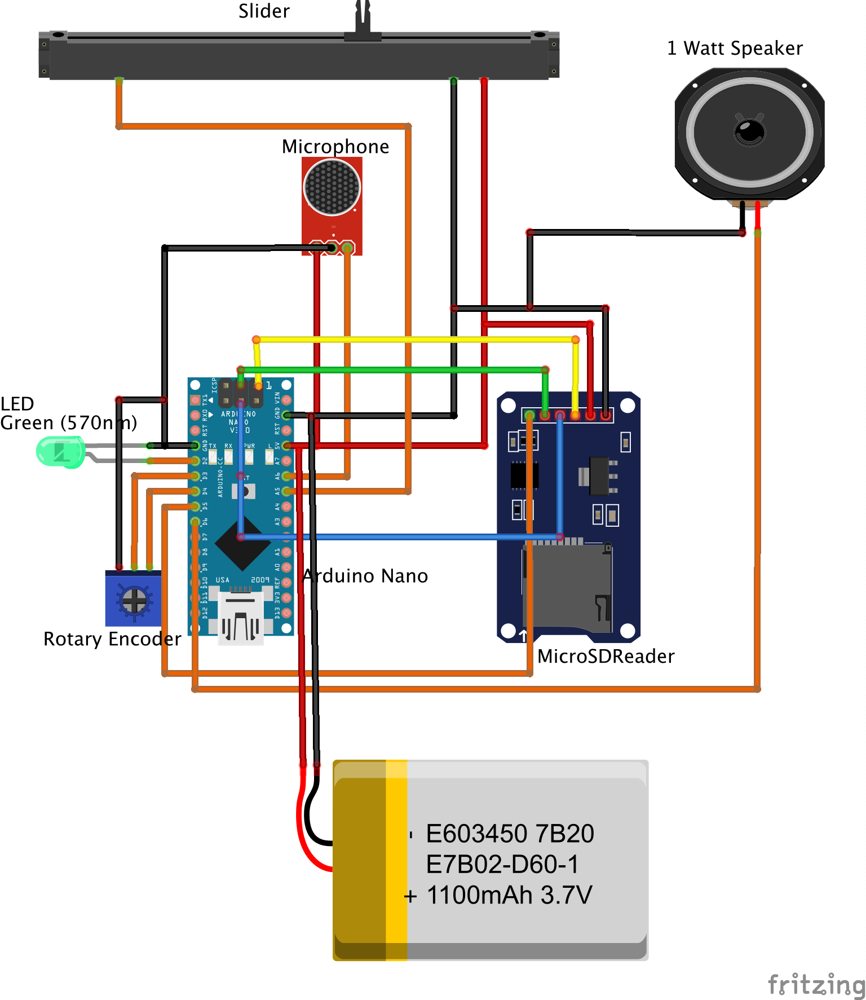
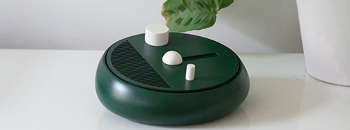

# Frankie
This project consists of code for audio recording and playback. The concept is used for creating spoken reflections in private spaces like homes. The circuit connections to _Frankie_ is also shown here. The components needed are:

1. ANGEEK MAX9814 High Performance Microphone AGC Amplifier Module CMA-4544PF-W
2. KY-040 Rotary Encoder Module
3. SPI reader micro memory SD TF card memory card shield module
4. Arduino Nano or equivalent 
5. Motorised Potentiometer 

Then they are connected as per the following (click on image to show in full size):
)

These functionalities were then used to create different iterations and designs, resulting in the creation of Frankie. Frankie is a research product and tracking device with a total of three buttons: the top button is attached to a rotary encoder and allows you to indicate the number of activities. The middle button is attached to a motorised potentiometer (ALPS RS60N). Sliding this button to the right will increase the force-feedback, as such increasing the weight or resistance you feel. With this slider, the user indicates the perceived weight of the activity. Lastly, the bottom knob is for recording. As probably not all activities demand a spoken reflection, users have the option to press this knob once they do want to leave one. By pressing the knob, build-in LEDs will light up, indicating that the device is recording. Releasing this button will stop and store the recording. 

Frankie with the 3D printed casing over the hardware components is seen in the following image:

)
